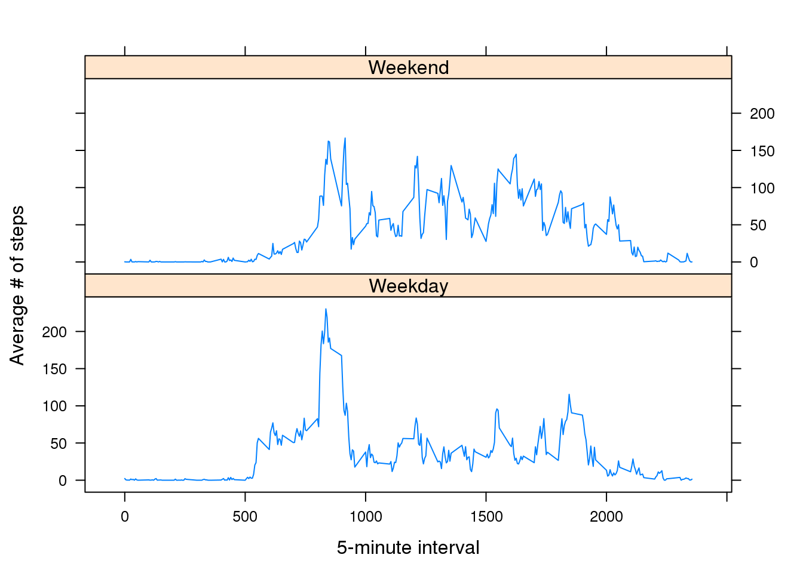

Reproducible Research: Peer Assessment 1
========================================

The goal of this assignment is to use R Markdown for an exploratory study of human daily activity based off reported number of steps recorded by a personal fitness tracker, such as Fitbit or Jawbone Up.

Loading and preprocessing the data
----------------------------------

The data is provided in form of a zipped CSV file `activity.zip` containing:

-   **steps**: number of steps taken in a 5-minute interval
    -   Missing values are coded as `NA`
-   **date**: date of the measurement
-   **interval**: five minute interval of the day (hhmm)

``` {.r}
act_data <-read.csv(unzip("activity.zip"),colClasses=c('numeric','Date','numeric'))
```

What is mean total number of steps taken per day?
-------------------------------------------------

We can sum the number of steps taken per day for every day:

``` {.r}
step_sum<-aggregate(steps~date,act_data,sum)
hist(step_sum$steps,breaks=20,xlab="Steps per day",main="")
```


`aggregate` automatically strips out `NA`, so we don't count days with missing information as 0s. In total there are 53 days with recorded steps.

``` {.r}
step_mean<-mean(step_sum$steps)
step_median<-median(step_sum$steps)
```

-   Mean daily steps: **10766.19** days
-   Median daily steps: **10765.00** days

What is the average daily activity pattern?
-------------------------------------------

Here we present the number of steps taken per a 5-minute interval of a day, averaged across the days present in the dataset. There are 24\*60/5 = **288** intervals.

``` {.r}
step_mean_interval <- aggregate(steps ~ interval,act_data,mean)
names(step_mean_interval)<-c("interval","avg_steps")
plot(step_mean_interval,type="l",xlab="5-minute interval",ylab="Average # of steps",main="")
```


``` {.r}
best_interval <- step_mean_interval$interval[which.max(step_mean_interval$avg_steps)]
```

Time interval with most average steps is: **835**

Imputing missing values
-----------------------

Missing entries have a potential to skew our results. Let's find how much incomplete data we have:

``` {.r}
num_missing <- sum(is.na(act_data$steps))
```

There are **2304** entries in our dataset.

Let's fill in the gaps. Every NA value will be replaced by the average of that time interval.

``` {.r}
comp_act_data <- merge(act_data,step_mean_interval,by="interval")
na_index <- is.na(comp_act_data$steps)
comp_act_data$steps[na_index]<-comp_act_data$avg_steps[na_index]
```

Now that we have values for all time intervals we can repeat the histogramming from above:

``` {.r}
step_sum<-aggregate(steps~date,comp_act_data,sum)
hist(step_sum$steps,breaks=20,xlab="Steps per day",main="")
```


``` {.r}
step_mean<-mean(step_sum$steps)
step_median<-median(step_sum$steps)
```

-   Mean daily steps: **10766.19** days
-   Median daily steps: **10766.19** days

As we can see, the addition of the missing values has increased the median and brought it in alignment with the mean. The distribution now is roughly normal.

Are there differences in activity patterns between weekdays and weekends?
-------------------------------------------------------------------------

Now let's see if people are more active on the weekends or the weekdays. For that we need to break up our data based on the day of the week:

``` {.r}
comp_act_data$day_type <- weekdays(comp_act_data$date) %in% c("Saturday","Sunday")
comp_act_data$day_type <- factor(comp_act_data$day_type,levels=c(F,T),labels=c("Weekday","Weekend"))
```

Let's plot what the average number of steps is for a weekday and for a weekend:

``` {.r}
step_mean_day <- aggregate(steps ~ interval + day_type,comp_act_data,mean)

library(lattice) #Prettier plot

xyplot(step_mean_day$steps ~ step_mean_day$interval | step_mean_day$day_type,type="l",layout=c(1,2),xlab="5-minute interval",ylab="Average # of steps",main="")
```



As we can see, people tend to be more active on the weekends, spreading out their activity across the entire day. The large spike in activity during the weekday mornings is likely an indicator of a morning workout routing.

This concludes our exploratory analysis of activity data!
